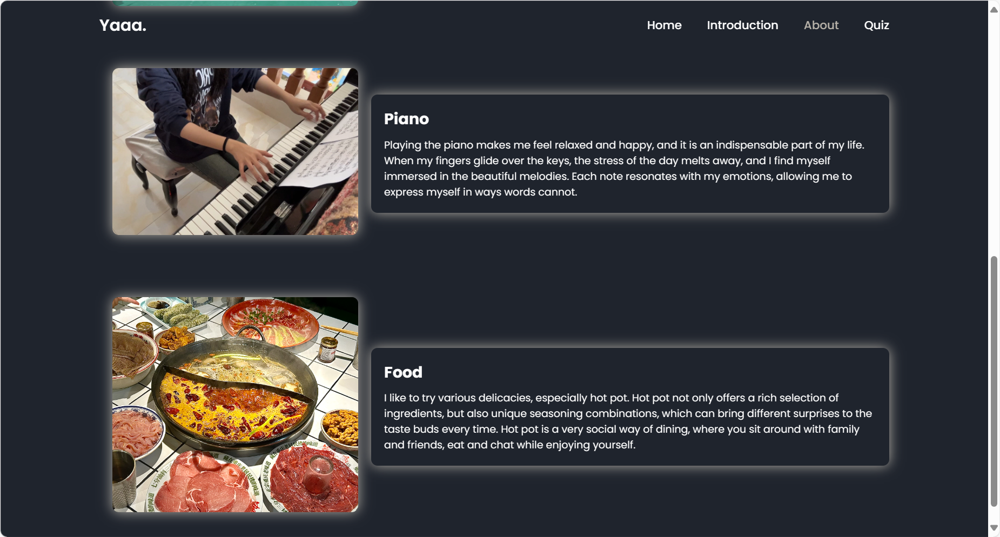

# Report for Web Application Development Assignment

**Author:** [YAQIAN HUANG]  
**Course:** CS2053 – Web Application Development    
**Date:** [24/05/2024]

---
## Catalogue
- [Introduction](#introduction)
- [Overall website design](#overall-website-design)
  - [Page overview](#page-overview)
  - [Design style](#2design-style)
- [Test application program design](#test-application-program-design)
  - [Start quiz](#1start-quiz)
  - [Load display issue and countdown](#2load-display-issue-and-countdown)
  - [Handling user selection](#3handling-user-selection)
  - [Post test statisics](#4post-test-statistics)
  - [Leaderboard](#5leaderboard)
- [Challenge](#challenge)
- [References](#references)
- [Conclusion](#conclusion)
## Introduction

This report details the development of a simple website and an interactive quiz application as part of the CS2053 – Web Application Development course. The project involves creating a four-page website with a homepage, personal introduction, detailed information about myself, and a quiz application.For aesthetics and completeness, I have added an additional homepage. The website is built using HTML, CSS, and JavaScript. This report covers the design, implementation, challenges faced, and the communication between the client side and the server.

## Overall website design
The website consists of four pages, namely home, Introduction, about, and quiz. Here is a brief introduction to the webpage

### 1. Page overview
#### -*Home*
The homepage is the entry point of a website, providing navigation links to other pages and containing some eye-catching content and features that attract users. In order to learn more about me, users can click on small icons to jump to other websites, such as clicking "more", and then jump to my account of Tiktok.
 <br>
#### -*Introduction*
The introduction page includes a personal introduction and a general overview of the website, allowing users to understand the website and the services it provides.
<br>
#### -*About*
The page will provide more detailed information about me, and it introduces my hobbies through pictures and text.

<br>
#### -*Quiz*
The quiz page is the core function that allows users to connect and answer quiz questions. After answering the questions, the final results will be displayed, including the number of correct answers, answer time, and ranking list. <br>
User enters their name.

Each question will display a specific time limit, and users need to select answers within the specified time. 

After submitting the answer, the user will immediately receive a response from the server, displaying the correctness of the answer and waiting for the user's action before moving to the next question.


After answering the questions, display the number of correct answers, answer time, and ranking list to the user

<br>
### 2.Design style
The following introduces the main design styles of web pages and provides some code to better understand them<br>
#### -*Animation style*
Enhance user experience through animation effects, making the page more interactive and attractive.

I added an animation style when setting up the navigation bar, making it appear dynamically
```
    <nav class="navbar">
      <a href="index.html" style="--i:1" id="homelink">Home</a>
      <a href="introduction.html" style="--i:2" id="introduction-link">Introduction</a>
      <a href="about.html" style="--i:3" id="about-link">About</a>
      <a href="quiz.html" style="--i:4" id="quiz-link">Quiz</a>
    </nav>
```

```css
    .navbar a {
    margin-left: 35px;
    opacity: 0;
    transition: 0.3s;
    animation: slideTop 1s ease forwards;
    animation-delay: calc(.2s * var(--i));
}
```
#### -*Card Based Design*
Using a card layout to organize content, each card can independently display information, suitable for various devices and screen sizes. Advantages:
1. Responsiveness
They help to quickly reposition and reorder content based on screen size.
2. Neat and tidy
Cards help organize the content on web pages neatly and avoid confusion.
3. Easy to digest
Clear information and related images, videos, or animations make the card easy to use and understand.
```css
position: fixed;/* positioned relative to the browser window,stays in that position even when the page is scrolled.*/
```
```css
.quiz-box, .question-box {
    background: #1f242d;
    padding: 20px;
    border-radius: 10px;
    box-shadow: 0 0 20px #b7b2a9;
    text-align: center;
    max-width: 600px;
    width: 100%;
}
```
#### -*Image Driven*
The design aims to attract user attention through eye-catching images. This design style usually has the following characteristics:
1. These images are usually related to the theme of the website and can immediately attract the user's attention.
2. The content is concise and clear, without taking up too much page space.
3. Create a clear visual hierarchy to ensure that users can easily navigate and understand content.
```css
.home-img img {
    max-width: 450px;
    border-radius: 50%;
    margin-right: -20px;
    box-shadow: 0 0 20px #b7b2a9;
    opacity: 0;
    animation: zoomIn 1s ease forwards, floatImage 4s ease-in-out infinite;
    animation-delay: 2s, 3s;
}
```
#### -*Dark Mode Style*
The webpage has a unified color style, designed with a dark background and bright text, which can reduce eye fatigue and reduce glare during nighttime use.
```css
body {
    background: #1f242d;
    color: #fff;
}

.logo {
    color: #fff;
}
```
## Test application program design
The test application client is responsible for presenting test questions, receiving user input, and submitting answers to the server. To achieve real-time interaction, the client uses Socket.IO communicates with the server. Socket.IO is a WebSocket based library that allows for bidirectional communication between clients and servers.
### 1.Start Quiz

When the user clicks the start quiz button, Username will be stored in the value. If username is not written, the user will be prompted with "please enter your name".<br>
### 2.Load display issue and countdown

The loadQuestion function has been defined to load and display the current issue. If there are no remaining issues, call the endQuiz function; Otherwise, retrieve the current problem object, set options, initialize the countdown, and start. If time runs out, call the submitAnswer function.<br>
### 3.Handling user selection
To ensure the correctness of verifying user answers, the client is responsible for collecting user input and initiating requests, while the server is responsible for verifying answers and returning results.<br>
The client defines the submitAnswer function to submit the answer selected by the user and verify its correctness. It retrieves the answer selected by the user from the DOM, compares it with the correct answer to the current question, and if correct, updates the score and displays a message. 
```JS
function submitAnswer() {
    const selectedOption = document.querySelector('.option.selected');
    let answer = selectedOption ? selectedOption.dataset.value : null;
    let correct = false;
    if (answer === questions[currentQuestion].answer) {
        correct = true;
        score++;
    }
    resultText.textContent = correct ? 'Congratulations, you answered correctly!' : 'Unfortunately, your answer is incorrect';
    resultModal.style.display = 'flex';
}
```
The server processes the answer request submitted by the client, verifies the correctness of the answer, and returns the result to the client so that the client can proceed with subsequent processing based on this result.
```JS
const bodyParser = require('body-parser');
app.use(bodyParser.json());

app.post('/submit-answer', (req, res) => {
    const { question, answer } = req.body;
    const correctAnswer = question.answer;
    let correct = false;

    if (answer === correctAnswer) {
        correct = true;
    }

    res.json({ correct: correct });
});
```
### 4.Post test statistics
The "endQuiz" function is defined to display the final result at the end of the test and send the result to the server, which then requests and displays the leaderboard.
```js
socket.emit('submit-result', userResult); //Send user results to the server
socket.emit('request-leaderboard');//Request leaderboard information
```

### 5.Leaderboard
Clients use Socket.IO sends a submit result event, the server receives the data and adds it to the leaderboard. Then, the server sorts the leaderboard and sends the updated leaderboard data back to the client.

Use the socket.on method to listen for "update leaderboard" events sent from the server and receive the latest leaderboard data sent by the server. 
```js
let leaderboard = [];
io.on('connection', (socket) => {
  socket.on('submit-result', (data) => {
      leaderboard.push(data);
      leaderboard.sort((a, b) => {
        if (a.score === b.score) {
          return a.time - b.time;
        }
        return b.score - a.score;
      });
      fs.writeFileSync(leaderboardFile, JSON.stringify(leaderboard, null, 2));
      io.emit('leaderboard', leaderboard);
  });
  socket.on('request-leaderboard', () => {
    socket.emit('update-leaderboard', leaderboard);
});
});
```
## Challenge
### 1.Ensure consistent style and aesthetically pleasing and tidy design
Different pages may have different layouts and elements, requiring a unified style and maintaining the visual appeal of the page.<br>
### 2.Responsive layout technology for cross device adaptation
Ensure that the website can be presented well on different devices, requiring flexible layout techniques to adapt to different screen sizes and resolutions.<br>
### 3.Clear Quiz page logic
Ensure clear logic on the Quiz page, including the display of questions, user answering, result feedback, and other processes. It is necessary to avoid situations of logical confusion or poor user experience.<br>
### 4.Handle Socket IO real-time communication and asynchronous operations
Using a Socket When implementing real-time communication through IO, it is necessary to effectively handle asynchronous operations to ensure timely transmission and processing of messages.
### 5.Smooth communication between clients and servers
The smooth communication between the client and server is crucial for verifying user information and providing good service. Any communication interruption or delay may affect the user experience
### 6.Project management and time management
Completing projects with high quality within a limited time frame, including coding, testing, document writing, and other tasks, is a significant challenge.


## References
1.W3C. (n.d.). HTML Validator. Retrieved from https://validator.w3.org/
2.Bootstrap Documentation. (n.d.).   https://getbootstrap.com/docs/5.0/getting-started/introduction/
3.Node.js Documentation. (n.d.). Retrieved from https://nodejs.org/en/docs/Node.js 
4.Socket.IO Documentation. (n.d.). Retrieved from https://socket.io/docs/

## Conclusion
By completing this assignment, I have gained practical experience in web development. The project has strengthened my understanding of HTML, CSS, and JavaScript, as well as client-server communication in web applications.
I hope to further deepen my learning and exploration of more advanced web development technologies in the future, and apply the knowledge I have learned to practical situations